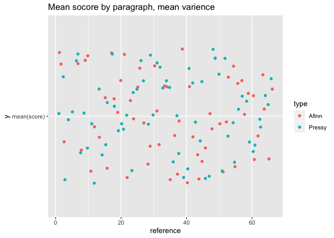

Overview
================
GameLab Team
5/29/2020

# How do sentiment models work?

Lexicons thats how, here are 5 randomly sampled words from four popular
lexicons and then ours. Here is where we can add a whole bunch of text.
I will use a bunch of the options to really help you see how well this
works.

## Wow

### Smaller

\*List +item 1 +item 2

| Column 1 | Column 2       | Column 3 |
| -------- | -------------- | -------- |
| Obama    | President      | Dude     |
| Bush     | President      | Bro      |
| Biden    | Vice President | Guy      |

    ## # A tibble: 5 x 3
    ##   word          value type 
    ##   <chr>         <dbl> <chr>
    ## 1 better            2 Afinn
    ## 2 screwed          -2 Afinn
    ## 3 manipulating     -1 Afinn
    ## 4 compassionate     2 Afinn
    ## 5 gray             -1 Afinn

    ## # A tibble: 5 x 3
    ##   word      sentiment type 
    ##   <chr>     <chr>     <chr>
    ## 1 integrity trust     NRC  
    ## 2 clap      joy       NRC  
    ## 3 bothering sadness   NRC  
    ## 4 atone     trust     NRC  
    ## 5 deluge    negative  NRC

    ## # A tibble: 5 x 3
    ##   word       sentiment type 
    ##   <chr>      <chr>     <chr>
    ## 1 felon      negative  Bing 
    ## 2 lechery    negative  Bing 
    ## 3 dishearten negative  Bing 
    ## 4 disputed   negative  Bing 
    ## 5 sever      negative  Bing

    ## # A tibble: 5 x 3
    ##   word       sentiment    type    
    ##   <chr>      <chr>        <chr>   
    ## 1 defraud    negative     Loughran
    ## 2 dependent  constraining Loughran
    ## 3 bottleneck negative     Loughran
    ## 4 evade      negative     Loughran
    ## 5 acquirees  litigious    Loughran

    ## # A tibble: 5 x 5
    ##   word      president score occassion                 type  
    ##   <chr>     <chr>     <dbl> <chr>                     <chr> 
    ## 1 projects  obama         2 State of the Union (2011) pressy
    ## 2 standards obama         1 Climate Change (2013)     pressy
    ## 3 help      obama         3 SOTU_15                   pressy
    ## 4 country   obama         3 SOTU_15                   pressy
    ## 5 protect   obama         3 Selma                     pressy

## Including Plots

Here is the big plot that loos super
messy.

<!-- --><!-- -->

And it is clear that this is a graphic that says some
stuff.

    ## Warning: Removed 5 rows containing missing values (geom_point).

<!-- -->

Values of under zero indicate that our analysis was substantially more
positive than Afinn
