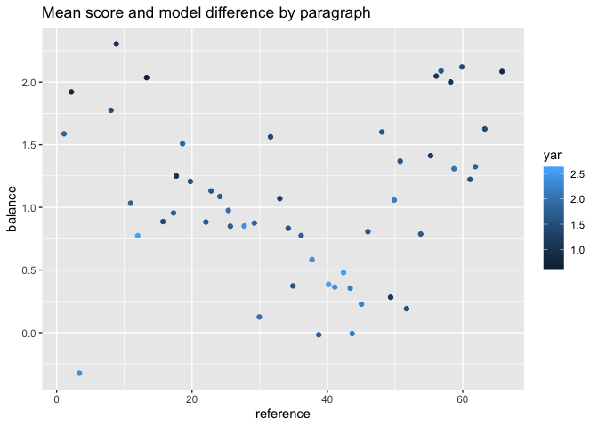

Can we
================
Your names in alphabetical order with Dan
5/29/2020

# How do sentiment models work?

Lexicons thats how, here are 5 randomly sampled words from four popular
lexicons and then ours. Here is where we can add a whole bunch of text.
I will :brain: use a bunch of the options to really help you see how
well this works. \[1\]

  - amazing
      - boop

## Wow

### Smaller

| Column 1 | Column 2       | Column 3 |
| -------- | -------------- | -------- |
| Obama    | President      | Dude     |
| Bush     | President      | Bro      |
| Biden    | Vice President | Guy      |

\#\#A variety of things

| word      | president | score | occassion |
| :-------- | :-------- | ----: | :-------- |
| economy   | obama     |     3 | SOTU      |
| polan     | obama     |     2 | SOTU      |
| health    | obama     |     2 | SOTU      |
| education | obama     |     2 | SOTU      |

A subset of our system.

    ## # A tibble: 62 x 9
    ##    reference `sum(value)` `sd(score).x` `mean(score).x` type.x `sum(score)`
    ##        <int>        <dbl>         <dbl>           <dbl> <chr>         <dbl>
    ##  1         1            5         2.22             1.25 Afinn            25
    ##  2         2           10         0.516            1.67 Afinn            50
    ##  3         3           -4         2.08            -1.33 Afinn            11
    ##  4         7           -1        NA               -1    Afinn            14
    ##  5         8            8         1.67             1.6  Afinn            74
    ##  6         9           14         0.816            2.33 Afinn            25
    ##  7        10            6         0.577            1.5  Afinn            NA
    ##  8        11            0         2                0    Afinn            62
    ##  9        12            5         2.83             1    Afinn            22
    ## 10        13            6         0                2    Afinn            29
    ## # … with 52 more rows, and 3 more variables: `sd(score).y` <dbl>,
    ## #   `mean(score).y` <dbl>, type.y <chr>

    ## # A tibble: 5 x 3
    ##   word      value type 
    ##   <chr>     <dbl> <chr>
    ## 1 firing       -2 Afinn
    ## 2 warns        -2 Afinn
    ## 3 death        -2 Afinn
    ## 4 sparkling     3 Afinn
    ## 5 woeful       -3 Afinn

    ## # A tibble: 5 x 3
    ##   word       sentiment    type 
    ##   <chr>      <chr>        <chr>
    ## 1 orchestra  anger        NRC  
    ## 2 celebrity  anticipation NRC  
    ## 3 cautiously fear         NRC  
    ## 4 deformed   disgust      NRC  
    ## 5 immoral    disgust      NRC

    ## # A tibble: 5 x 3
    ##   word          sentiment type 
    ##   <chr>         <chr>     <chr>
    ## 1 insensitivity negative  Bing 
    ## 2 convoluted    negative  Bing 
    ## 3 tormented     negative  Bing 
    ## 4 heartfelt     positive  Bing 
    ## 5 brazenly      negative  Bing

    ## # A tibble: 5 x 3
    ##   word         sentiment   type    
    ##   <chr>        <chr>       <chr>   
    ## 1 embargoed    negative    Loughran
    ## 2 suddenly     uncertainty Loughran
    ## 3 incarcerate  litigious   Loughran
    ## 4 regulatory   litigious   Loughran
    ## 5 exacerbating negative    Loughran

    ## # A tibble: 5 x 5
    ##   word        president score occassion                        type  
    ##   <chr>       <chr>     <dbl> <chr>                            <chr> 
    ## 1 experiences obama         3 Trayvon Martin (2013)            pressy
    ## 2 surviors    obama         3 Arizona Shooting Memorial (2011) pressy
    ## 3 should      obama         1 SOTU_15                          pressy
    ## 4 no          obama        -1 Selma                            pressy
    ## 5 leaders     obama         3 Selma                            pressy

| word   | value | type  |
| :----- | ----: | :---- |
| firing |   \-2 | Afinn |
| warns  |   \-2 | Afinn |
| death  |   \-2 | Afinn |

A subset of our system.

| word       | sentiment    |
| :--------- | :----------- |
| orchestra  | anger        |
| celebrity  | anticipation |
| cautiously | fear         |
| deformed   | disgust      |
| immoral    | disgust      |

A subset of our system.

## Including Plots

Here is the big plot that loos super
messy.

<!-- --><!-- --><!-- -->

And it is clear that this is a graphic that says some
stuff.

    ## Warning: Removed 5 rows containing missing values (geom_point).

<!-- -->

``` marginfigure
Here is a random side note. As you may know, I love this stuff. 
```

Values of under zero indicate that our analysis was substantially more
positive than Afinn

1.  [Obama’s
    Farewell](https://www.presidency.ucsb.edu/documents/farewell-address-the-nation-from-chicago-illinois)
